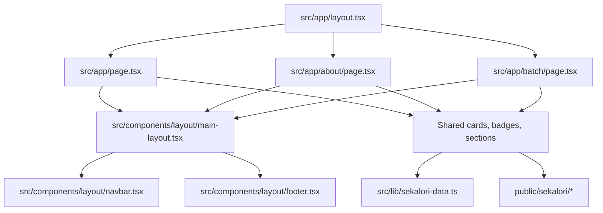

# Sekalori Figma Page Implementation Plan

## I. Executive Summary

- **Goal**: Implement the three Sekalori Figma designs as responsive, component-first Next.js App Router pages with shared navigation, footer, assets, and layout structure.
- **Success Metrics**:
  - `npm run lint` and `npm run build` complete without errors.
  - `/`, `/about`, and `/batch` render the Figma-specified content, imagery, navigation active states, and section structure.
  - Desktop and mobile Playwright checks confirm no horizontal overflow, no incoherent overlap, and all key images load from local `public/` assets.

## II. Skill Matrix

| Component | Required Skill | Implementation Role |
|-----------|----------------|---------------------|
| Roadmap and dependency sequencing | `planner` | Defines the staged implementation, dependencies, and acceptance tests before code changes. |
| Visual design translation | `frontend-design` | Preserves the Figma aesthetic while adapting it into production responsive UI. |
| Figma design-to-code context | Figma MCP `_get_design_context` | Provides node structure, text, colors, typography, and asset URLs for Home, About, and Batch designs. |
| Next.js App Router | Local Next docs in `node_modules/next/dist/docs/` | Guides route files, shared layouts, server/client component boundaries, CSS, fonts, and images for Next 16.2.6. |

## III. Logic & Architecture

The implementation will keep pages mostly as Server Components and isolate reusable UI in component files. The root `app/layout.tsx` will keep the required `<html>` and `<body>` tags. A new `MainLayout` component will wrap each page's children with shared `Navbar` and `Footer`, matching the user's requirement that the navbar and footer live in the main layout component.

## IV. Phased Roadmap

## Stage 1: Foundation and Assets
> **Entry Condition**: The repository is clean enough to edit, and the three Figma nodes have been inspected through the Figma MCP.
> **Exit Condition**: The project has stable local Sekalori design assets, typography tokens, and a shared data model ready for page composition.

### Module 1.1: Figma Asset Capture

- [ ] [P1.1.1] Create Sekalori asset directory: Add `public/sekalori/` for downloaded Figma images and SVG assets.
      depends_on: none
      Verify: `test -d public/sekalori`

- [ ] [P1.1.2] Download Figma assets locally: Fetch the hero, menu, logo, cart, icon, botanical, footer, and social assets referenced by nodes `17:1206`, `49:40`, and `17:1363`.
      depends_on: P1.1.1
      Verify: `find public/sekalori -type f | wc -l` returns a non-zero count and no downloaded file is empty.

- [ ] [P1.1.3] Normalize asset filenames: Rename downloaded assets into descriptive kebab-case filenames grouped by usage, such as `logo-primary.svg`, `home-hero-bowl.png`, and `batch-monday-meal.png`.
      depends_on: P1.1.2
      Verify: `find public/sekalori -type f | rg '[A-Z]| '` returns no filenames.

### Module 1.2: Design Tokens and Content Data

- [ ] [P1.2.1] Update global design tokens: Replace starter body styling in `src/app/globals.css` with Sekalori color variables, typography variables, base background, focus styles, and responsive media defaults.
      depends_on: none
      Verify: `rg -- '--sekalori|--color|font-family|box-sizing' src/app/globals.css`

- [ ] [P1.2.2] Update Next font configuration: Configure `Plus_Jakarta_Sans` and `Poppins` through `next/font/google` in `src/app/layout.tsx`, following the local Next font documentation.
      depends_on: P1.2.1
      Verify: `rg 'Plus_Jakarta_Sans|Poppins|next/font/google' src/app/layout.tsx`

- [ ] [P1.2.3] Create shared Sekalori content data: Add `src/lib/sekalori-data.ts` for nav links, footer links, menu cards, FAQ items, benefits, ingredients, and partner placeholders.
      depends_on: P1.2.1
      Verify: `test -f src/lib/sekalori-data.ts && rg 'menuItems|faqItems|benefits|ingredients' src/lib/sekalori-data.ts`

### Stage 1 Test Procedures

#### Test 1.1: Asset Availability
- **Type**: Manual
- **Preconditions**: Stage 1 asset tasks are complete.
- **Steps**:
  1. Run `find public/sekalori -type f -maxdepth 2`.
  2. Run `find public/sekalori -type f -size 0`.
- **Expected Result**: The asset list contains every locally referenced image/icon needed by the pages, and the empty-file command prints no files.
- **Pass Command**: `find public/sekalori -type f -size 0`
- **Fail Indicators**: Missing hero/menu/logo assets, empty files, or filenames that still depend on temporary Figma asset IDs.

#### Test 1.2: Token and Font Compilation
- **Type**: Integration
- **Preconditions**: Global CSS and font configuration are updated.
- **Steps**:
  1. Run `npm run lint`.
  2. Run `npm run build`.
- **Expected Result**: Both commands complete with exit code `0`.
- **Pass Command**: `npm run lint && npm run build`
- **Fail Indicators**: Next font import errors, Tailwind parse errors, TypeScript errors, or missing CSS variable references.

## Stage 2: Shared Component System
> **Entry Condition**: Stage 1 has local assets, tokens, fonts, and shared content data.
> **Exit Condition**: Shared layout, navigation, footer, and reusable page sections exist and can be used by all three routes.

### Module 2.1: Layout Components

- [ ] [P2.1.1] Create `MainLayout`: Add `src/components/layout/main-layout.tsx` that renders `Navbar`, a main content slot, and `Footer` around `children`.
      depends_on: P1.2.3
      Verify: `rg 'function MainLayout|children|Navbar|Footer' src/components/layout/main-layout.tsx`

- [ ] [P2.1.2] Create responsive navbar: Add `Navbar` with logo, active route prop, Home/About/Batch links, cart button, and order button using flexbox-first styling.
      depends_on: P2.1.1
      Verify: `rg 'activeRoute|Home|About|Batch|Order Now' src/components/layout/navbar.tsx`

- [ ] [P2.1.3] Create responsive footer: Add `Footer` with logo, address, social links, company/legal columns, and copyright content matching Figma.
      depends_on: P2.1.1
      Verify: `rg 'Jl\\. Kumbang|Privacy Policy|Terms of Service|2026 SEKALORI' src/components/layout/footer.tsx`

### Module 2.2: Reusable UI Components

- [ ] [P2.2.1] Create primitive visual components: Add reusable `Badge`, `ButtonLink`, `SectionHeader`, and `IconPill` components for repeated page elements.
      depends_on: P1.2.1
      Verify: `find src/components -type f | rg 'badge|button|section-header|icon-pill'`

- [ ] [P2.2.2] Create menu card component: Add a `MenuCard` component that renders a local image, day label, nutrition chips, title, and description.
      depends_on: P2.2.1, P1.2.3
      Verify: `rg 'MenuCard|nutrition|day|description' src/components`

- [ ] [P2.2.3] Create FAQ component: Add an accessible FAQ component using semantic `
` and `
` for open/closed states.
      depends_on: P2.2.1, P1.2.3
      Verify: `rg '<details|<summary|faqItems' src/components`

- [ ] [P2.2.4] Create feature card components: Add reusable components for benefit cards, ingredient cards, and partner placeholders used by About and Batch.
      depends_on: P2.2.1, P1.2.3
      Verify: `rg 'BenefitCard|IngredientCard|Partner' src/components`

### Stage 2 Test Procedures

#### Test 2.1: Shared Layout Structure
- **Type**: Integration
- **Preconditions**: Stage 2 layout components are implemented.
- **Steps**:
  1. Run `npm run lint`.
  2. Inspect `src/components/layout/main-layout.tsx`.
- **Expected Result**: The component accepts `children`, renders `Navbar` before the main content, renders `Footer` after it, and lint passes.
- **Pass Command**: `npm run lint`
- **Fail Indicators**: Missing `children`, nav/footer duplicated inside pages, or lint errors from unused imports.

#### Test 2.2: Semantic FAQ Edge Case
- **Type**: Manual
- **Preconditions**: FAQ component is implemented.
- **Steps**:
  1. Inspect the FAQ markup in `src/components`.
  2. Confirm each FAQ item can render a question without JavaScript.
- **Expected Result**: FAQ uses semantic disclosure elements and remains readable with JavaScript disabled.
- **Pass Command**: `rg '<details|<summary' src/components`
- **Fail Indicators**: FAQ relies on client-only state for basic disclosure, or questions are not keyboard-accessible.

## Stage 3: Page Implementation
> **Entry Condition**: Stage 2 shared components are implemented and compile.
> **Exit Condition**: `/`, `/about`, and `/batch` are built as sectioned responsive pages matching the Figma designs.

### Module 3.1: Home Page

- [ ] [P3.1.1] Replace starter home page: Implement `/` from Figma node `17:1206` using `MainLayout activeRoute="home"` and sectioned containers for hero, about preview, menu batch, and FAQ.
      depends_on: P2.1.3, P2.2.3
      Verify: `rg '<section|MainLayout|Isi Kalorimu|Menu Batch|Frequently Asked Questions' src/app/page.tsx`

- [ ] [P3.1.2] Wire home CTAs and anchors: Link `Order Now`, `View Batch`, `Lihat Detail`, and nav entries to meaningful local routes or section anchors.
      depends_on: P3.1.1
      Verify: `rg 'href=\"/batch|href=\"#|Order Now|View Batch|Lihat Detail' src/app/page.tsx src/components`

### Module 3.2: About Page

- [ ] [P3.2.1] Create About route: Add `src/app/about/page.tsx` for Figma node `17:1363`, including hero, service pills, benefits, and partners sections.
      depends_on: P2.1.3, P2.2.4
      Verify: `rg 'Nourishment Designed|Why Choose|Our Partners|MainLayout' src/app/about/page.tsx`

- [ ] [P3.2.2] Preserve About active navigation: Pass the About active state into shared layout and confirm link styling changes only through props/data.
      depends_on: P3.2.1
      Verify: `rg 'activeRoute=\"about\"' src/app/about/page.tsx`

### Module 3.3: Batch Page

- [ ] [P3.3.1] Create Batch route: Add `src/app/batch/page.tsx` for Figma node `49:40`, including hero, menu daily section, and local ingredients highlight.
      depends_on: P2.1.3, P2.2.4
      Verify: `rg 'Fiber Boost Week|Menu Harian|Bahan Segar dari Bogor|MainLayout' src/app/batch/page.tsx`

- [ ] [P3.3.2] Preserve Batch active navigation: Pass the Batch active state into shared layout and confirm link styling changes only through props/data.
      depends_on: P3.3.1
      Verify: `rg 'activeRoute=\"batch\"' src/app/batch/page.tsx`

### Stage 3 Test Procedures

#### Test 3.1: Route Build Coverage
- **Type**: Integration
- **Preconditions**: All three route files are implemented.
- **Steps**:
  1. Run `npm run build`.
  2. Confirm the build output includes `/`, `/about`, and `/batch`.
- **Expected Result**: Build exits `0` and all three routes are generated without missing image, metadata, or component errors.
- **Pass Command**: `npm run build`
- **Fail Indicators**: Missing route modules, unresolved asset paths, or hydration warnings caused by invalid markup.

#### Test 3.2: Required Section Semantics
- **Type**: Manual
- **Preconditions**: Page files are implemented.
- **Steps**:
  1. Inspect `src/app/page.tsx`, `src/app/about/page.tsx`, and `src/app/batch/page.tsx`.
  2. Count top-level content sections in each page.
- **Expected Result**: Each visible page area is wrapped in a semantic `<section>` container; nav and footer stay in `MainLayout`.
- **Pass Command**: `rg '<section' src/app src/components`
- **Fail Indicators**: Main page content rendered as unsectioned div soup, or navbar/footer duplicated inside page files.

## Stage 4: Responsive Styling and Verification
> **Entry Condition**: All three pages render locally and build.
> **Exit Condition**: Desktop and mobile verification confirms the UI is responsive, visually coherent, and ready for review.

### Module 4.1: Responsive Refinement

- [ ] [P4.1.1] Tune desktop layout: Adjust flex containers, max widths, spacing, image aspect ratios, and card sizing to match the 1280px Figma compositions.
      depends_on: P3.3.2
      Verify: Playwright screenshot at `1280x900` shows no horizontal overflow and all primary sections visible in expected order.

- [ ] [P4.1.2] Tune tablet and mobile layout: Add responsive stacking, wrapping, reduced paddings, button wrapping, and image scaling for `768px` and `390px` widths.
      depends_on: P4.1.1
      Verify: Playwright screenshots at `768x1024` and `390x844` show no text clipping, no overlapping controls, and no horizontal scroll.

- [ ] [P4.1.3] Verify image loading and alt text: Confirm every meaningful image has descriptive alt text and decorative images are hidden or empty alt.
      depends_on: P4.1.2
      Verify: Browser console has no 404s for `/sekalori/*`, and code inspection confirms alt text strategy.

### Module 4.2: Final Automated Checks

- [ ] [P4.2.1] Run lint: Execute project linting after all edits.
      depends_on: P4.1.3
      Verify: `npm run lint` exits `0`.

- [ ] [P4.2.2] Run production build: Execute Next production build after all edits.
      depends_on: P4.2.1
      Verify: `npm run build` exits `0`.

- [ ] [P4.2.3] Run browser smoke test: Start the dev server and inspect `/`, `/about`, and `/batch` in the in-app browser or Playwright.
      depends_on: P4.2.2
      Verify: Each route returns HTTP 200, renders the correct active nav state, and shows the expected hero headline.

### Stage 4 Test Procedures

#### Test 4.1: Desktop Visual Smoke
- **Type**: E2E
- **Preconditions**: Dev server is running after implementation.
- **Steps**:
  1. Open `http://localhost:<port>/` at `1280x900`.
  2. Open `http://localhost:<port>/about` at `1280x900`.
  3. Open `http://localhost:<port>/batch` at `1280x900`.
- **Expected Result**: Each route renders its Figma-matched hero, shared nav/footer, active nav state, loaded imagery, and no visible layout overlap.
- **Pass Command**: Browser or Playwright screenshot workflow for all three URLs.
- **Fail Indicators**: Blank page, broken image icons, duplicated navbar/footer, active nav mismatch, or horizontal scrollbar.

#### Test 4.2: Mobile Responsive Smoke
- **Type**: E2E
- **Preconditions**: Dev server is running after implementation.
- **Steps**:
  1. Open `http://localhost:<port>/` at `390x844`.
  2. Open `http://localhost:<port>/about` at `390x844`.
  3. Open `http://localhost:<port>/batch` at `390x844`.
- **Expected Result**: All content stacks cleanly, buttons wrap or resize without clipping, card grids become single-column, text remains readable, and there is no horizontal overflow.
- **Pass Command**: Browser or Playwright screenshot workflow for all three URLs at mobile viewport.
- **Fail Indicators**: Text clipped inside buttons/cards, image overlap, content wider than viewport, or nav controls colliding.

#### Test 4.3: Automated Project Health
- **Type**: Integration
- **Preconditions**: All implementation and responsive refinements are complete.
- **Steps**:
  1. Run `npm run lint`.
  2. Run `npm run build`.
- **Expected Result**: Both commands exit `0`.
- **Pass Command**: `npm run lint && npm run build`
- **Fail Indicators**: ESLint errors, TypeScript errors, unresolved imports, invalid Next image usage, or Tailwind compilation errors.

## V. Final Verification Checklist

- [ ] `/` matches the Home design content and active nav state from Figma node `17:1206`.
- [ ] `/about` matches the About design content and active nav state from Figma node `17:1363`.
- [ ] `/batch` matches the Batch design content and active nav state from Figma node `49:40`.
- [ ] Shared `MainLayout` owns navbar and footer, with page content passed as `children`.
- [ ] Page content is organized with semantic `<section>` containers.
- [ ] Components are reused for layout, nav, footer, menu cards, badges, FAQ, benefits, ingredients, and partners.
- [ ] Styling uses flexbox-first layout, with grid only where card grids are the clearer pattern from the design.
- [ ] Figma MCP asset URLs are not used directly in code; local `public/sekalori/` paths are used instead.
- [ ] `npm run lint` passes.
- [ ] `npm run build` passes.
- [ ] Browser verification passes at desktop and mobile widths for all three routes.
