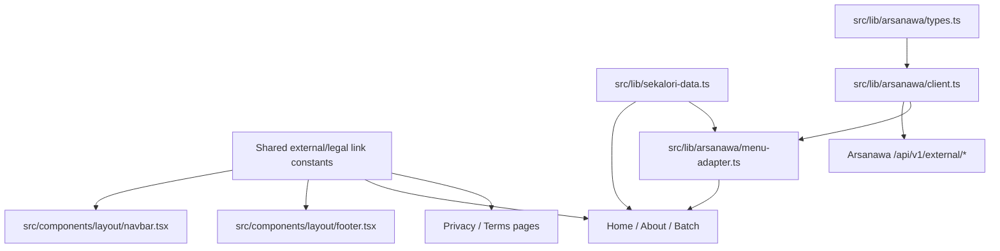

# Sekalori Navigation, Legal, CTA, and ERP Prep Plan

## I. Executive Summary

- **Goal**: Update Sekalori's public pages so required links, badges, legal routes, CTAs, and Arsanawa ERP API preparation are production-ready.
- **Success Metrics**:
  - `npm run lint` and `npm run build` complete without errors.
  - `/`, `/about`, `/batch`, `/privacy-policy`, and `/terms-of-service` render with no broken links, missing icons, contrast regressions, or cart button in the navbar.
  - Arsanawa ERP integration code keeps `X-API-Key` server-only, uses environment configuration, and preserves static fallback data when ERP configuration is absent or unavailable.

## II. Skill Matrix

| Component | Required Skill | Implementation Role |
|-----------|----------------|---------------------|
| Roadmap and dependency sequencing | `planner` | Defines stages, dependency order, and acceptance tests before implementation. |
| Frontend polish and accessibility | `frontend-design` | Keeps badge contrast, icon selection, page hierarchy, and legal content presentation consistent with the Sekalori brand. |
| GSAP/Lenis compatibility | `gsap-core`, `gsap-react`, `gsap-performance`, `gsap-scrolltrigger` | Preserves the existing `useGSAP`, `ScrollTrigger`, and Lenis setup while avoiding layout-heavy animation regressions. |
| Next.js App Router | Local Next 16.2.6 docs in `node_modules/next/dist/docs/` | Guides internal pages, external links, route handlers, server-only environment variables, and server-side fetch behavior. |
| Arsanawa ERP external API | Local API source at `/Users/aliceevr/Documents/Workspace/Arsanawa/arsanawa-erp/api-arsanawa-erp` | Provides endpoint contracts for `X-API-Key`, product lookup, price lookup, and catering-order readiness. |

## III. Logic & Architecture

The UI changes stay in existing Server Components and shared primitives. External ordering remains a direct Google Forms link. Legal content becomes static App Router pages. ERP preparation adds a server-only client and data adapter that can feed menu data from Arsanawa later while falling back to `src/lib/sekalori-data.ts` when env vars are missing.

Assumptions resolved before planning:
- Legal destination will be implemented as internal pages at `/privacy-policy` and `/terms-of-service`, not modal-only UI.
- ERP configuration will use server-only env vars such as `ARSANAWA_ERP_API_BASE_URL`, `ARSANAWA_ERP_EXTERNAL_API_KEY`, and optional `ARSANAWA_ERP_BRANCH_ID`.
- The ERP API key is generated/configured inside Arsanawa ERP and consumed by this frontend only from the server, sent as the `X-API-Key` header.
- The current Google Forms order CTA will be an external link to `https://forms.gle/7jigWt5ur74kbtcv8`.

## IV. Phased Roadmap

## Stage 1: Shared Link and Badge Fixes
> **Entry Condition**: Current repository state is unchanged except this plan file; Next 16.2.6 linking and environment docs have been reviewed.
> **Exit Condition**: Required public links, nav behavior, and hero badges are fixed across Home, About, Batch, Navbar, and Footer.

### Module 1.1: Link Constants and CTA Routing

- [ ] [P1.1.1] Centralize external and legal URLs: Add shared constants for Google Forms, Instagram, WhatsApp, privacy policy, and terms routes in `src/lib/sekalori-data.ts` or a focused link constants module.
      depends_on: none
      Verify: `rg 'forms.gle/7jigWt5ur74kbtcv8|instagram.com/seka.lori|wa.me/6285173075151|privacy-policy|terms-of-service' src/lib src/components src/app`

- [ ] [P1.1.2] Extend link primitive for external links: Update `ButtonLink` to support `target`, `rel`, and external hrefs without breaking existing internal `next/link` usage.
      depends_on: P1.1.1
      Verify: `rg 'target|rel|ButtonLinkProps' src/components/ui/button-link.tsx`

- [ ] [P1.1.3] Point all Order Now CTAs to Google Forms: Update navbar and page-level `Order Now` buttons to use the Google Forms URL and safe external-link attributes.
      depends_on: P1.1.2
      Verify: `rg 'Order Now|forms.gle/7jigWt5ur74kbtcv8|target="_blank"|rel=' src/app src/components`

### Module 1.2: Navbar and Footer Corrections

- [ ] [P1.2.1] Remove the navbar cart button: Delete the cart icon/link from `src/components/layout/navbar.tsx` and adjust spacing so the nav remains balanced.
      depends_on: P1.1.3
      Verify: `! rg 'Open cart|IconShoppingBag|href="#"' src/components/layout/navbar.tsx`

- [ ] [P1.2.2] Fix footer social actions: Update Instagram and WhatsApp footer links to the requested URLs with `target="_blank"` and `rel="noreferrer"`.
      depends_on: P1.1.1
      Verify: `rg 'instagram.com/seka.lori|wa.me/6285173075151|target="_blank"|noreferrer' src/components/layout/footer.tsx`

- [ ] [P1.2.3] Link footer legal buttons to internal pages: Replace `#` legal hrefs with `/privacy-policy` and `/terms-of-service`.
      depends_on: P1.1.1
      Verify: `rg 'Privacy Policy|Terms of Service|/privacy-policy|/terms-of-service' src/lib/sekalori-data.ts src/components/layout/footer.tsx`

### Module 1.3: Badge Icon and Contrast Fixes

- [ ] [P1.3.1] Fix Home halal badge icon: Replace the decorative dot with a check mark plus star icon treatment using Tabler icons or a compact icon pair, keeping the pill readable.
      depends_on: none
      Verify: `rg 'IconCheck|IconRosette|IconStar|Halal Certified' src/app/page.tsx`

- [ ] [P1.3.2] Fix About premium badge contrast and icon: Replace the low-contrast outlined dot with a suitable catering/award icon and stronger foreground/background contrast.
      depends_on: none
      Verify: `rg 'Premium Catering Excellence|IconAward|IconChefHat|IconSparkles|text-\\[#' src/app/about/page.tsx`

- [ ] [P1.3.3] Fix Batch date badge icon: Replace the decorative square with a calendar icon for the `Nov 13 - Nov 17` pill.
      depends_on: none
      Verify: `rg 'Nov 13 - Nov 17|IconCalendar|IconCalendarWeek' src/app/batch/page.tsx`

### 🧪 Stage 1 Test Procedures

#### Test 1.1: Required Link Targets
- **Type**: Integration
- **Preconditions**: Stage 1 link and footer tasks are complete.
- **Steps**:
  1. Run `rg 'href="#"|Open cart|IconShoppingBag' src/app src/components src/lib`.
  2. Run `rg 'forms.gle/7jigWt5ur74kbtcv8|instagram.com/seka.lori|wa.me/6285173075151|/privacy-policy|/terms-of-service' src/app src/components src/lib`.
- **Expected Result**: The first command prints no stale cart or placeholder links except intentional in-page anchors; the second command prints the required destinations.
- **Pass Command**: `npm run lint`
- **Fail Indicators**: Any footer social link still uses `#`, the cart button is still present, or an `Order Now` CTA still points to `/batch`.

#### Test 1.2: Badge Visual Requirements
- **Type**: Manual
- **Preconditions**: Stage 1 badge tasks are complete and the dev server is running.
- **Steps**:
  1. Open `/`, `/about`, and `/batch`.
  2. Inspect the first hero pill on each page.
  3. Confirm the Home pill uses check/star symbolism, the About pill has a suitable catering/excellence icon and readable contrast, and the Batch pill uses a calendar icon.
- **Expected Result**: All three badges have meaningful icons, readable text, and no pale-on-pale contrast issue.
- **Pass Command**: `npm run build`
- **Fail Indicators**: Decorative dots remain, the About badge text is hard to read, or the Batch badge lacks a calendar icon.

## Stage 2: Legal Pages
> **Entry Condition**: Stage 1 footer legal links point to internal routes.
> **Exit Condition**: Dummy catering-company privacy and terms pages exist, render through the shared layout, and are reachable from the footer.

### Module 2.1: Legal Content Model

- [ ] [P2.1.1] Add legal copy data: Create reusable dummy catering-company legal content for privacy policy and terms of service with sections for service scope, customer data, orders, payments, cancellations, food safety, liability, and contact.
      depends_on: P1.2.3
      Verify: `rg 'Privacy Policy|Terms of Service|food safety|cancellation|customer data' src/lib src/app`

- [ ] [P2.1.2] Add legal page component: Create a shared legal content component that renders title, effective date, and section blocks with accessible headings.
      depends_on: P2.1.1
      Verify: `rg 'LegalPage|effective date|sections.map|<h1|<h2' src/components src/app`

### Module 2.2: App Router Legal Routes

- [ ] [P2.2.1] Create `/privacy-policy` route: Add `src/app/privacy-policy/page.tsx` with metadata and the shared layout.
      depends_on: P2.1.2
      Verify: `test -f src/app/privacy-policy/page.tsx && rg 'Privacy Policy|metadata|MainLayout' src/app/privacy-policy/page.tsx`

- [ ] [P2.2.2] Create `/terms-of-service` route: Add `src/app/terms-of-service/page.tsx` with metadata and the shared layout.
      depends_on: P2.1.2
      Verify: `test -f src/app/terms-of-service/page.tsx && rg 'Terms of Service|metadata|MainLayout' src/app/terms-of-service/page.tsx`

- [ ] [P2.2.3] Preserve footer active-neutral behavior: Ensure legal pages render the same navbar without incorrectly marking Home, About, or Batch active.
      depends_on: P2.2.1, P2.2.2
      Verify: `rg 'activeRoute' src/components/layout/main-layout.tsx src/app/privacy-policy/page.tsx src/app/terms-of-service/page.tsx`

### 🧪 Stage 2 Test Procedures

#### Test 2.1: Legal Route Build Coverage
- **Type**: Integration
- **Preconditions**: Both legal routes are implemented.
- **Steps**:
  1. Run `npm run build`.
  2. Confirm build output includes `/privacy-policy` and `/terms-of-service`.
- **Expected Result**: Build exits with code `0` and both legal pages compile with metadata.
- **Pass Command**: `npm run build`
- **Fail Indicators**: Missing route module, invalid metadata export, or `MainLayout` prop type errors.

#### Test 2.2: Footer Legal Navigation
- **Type**: Manual
- **Preconditions**: The dev server is running with Stage 2 complete.
- **Steps**:
  1. Open `/`.
  2. Click `Privacy Policy` in the footer.
  3. Return to `/`, then click `Terms of Service`.
- **Expected Result**: Each footer link navigates to a real legal page with dummy catering-company legal text and no 404.
- **Pass Command**: `npm run lint`
- **Fail Indicators**: Footer links still use `#`, legal pages are blank, or nav active state is incorrect on legal pages.

## Stage 3: Arsanawa ERP API Preparation
> **Entry Condition**: Stage 1 and Stage 2 public UI changes are complete.
> **Exit Condition**: The frontend has server-only ERP configuration, typed API client helpers, and menu adapters ready to replace static data when ERP is configured.

### Module 3.1: Server-Only Configuration

- [ ] [P3.1.1] Add ERP env documentation: Document `ARSANAWA_ERP_API_BASE_URL`, `ARSANAWA_ERP_EXTERNAL_API_KEY`, and optional `ARSANAWA_ERP_BRANCH_ID` in a non-secret example or README section.
      depends_on: none
      Verify: `rg 'ARSANAWA_ERP_API_BASE_URL|ARSANAWA_ERP_EXTERNAL_API_KEY|ARSANAWA_ERP_BRANCH_ID' README.md .env.example`

- [ ] [P3.1.2] Add ERP config helper: Create a server-only config module that reads env vars, normalizes the base URL, and exposes an `isConfigured` state without throwing during local development.
      depends_on: P3.1.1
      Verify: `rg 'server-only|process.env.ARSANAWA|isConfigured|baseUrl' src/lib`

- [ ] [P3.1.3] Keep API key out of client bundles: Ensure ERP config is imported only by Server Components, route handlers, or server-only library files; do not use `NEXT_PUBLIC_` for the API key.
      depends_on: P3.1.2
      Verify: `! rg 'NEXT_PUBLIC_ARSANAWA|ARSANAWA_ERP_EXTERNAL_API_KEY' src/components`

### Module 3.2: Typed ERP Client and Adapter

- [ ] [P3.2.1] Add external API TypeScript types: Define response types for `/api/v1/external/products`, product variants, price values, and external catering-order payload shape based on the ERP OpenAPI/tests.
      depends_on: P3.1.2
      Verify: `rg 'ArsanawaExternalProduct|ArsanawaProductVariant|ExternalCateringOrderPayload|price' src/lib`

- [ ] [P3.2.2] Add server fetch wrapper: Implement `fetchExternalProducts` and `fetchExternalVariantPrice` with `Accept: application/json`, `X-API-Key`, optional `branch_id`, and conservative error handling.
      depends_on: P3.2.1
      Verify: `rg 'X-API-Key|/api/v1/external/products|fetchExternalProducts|fetchExternalVariantPrice' src/lib`

- [ ] [P3.2.3] Add menu adapter fallback: Map ERP products into the existing `MenuItem` shape where possible and fall back to current static `homeMenuItems` / `batchMenuItems` when ERP is unconfigured, returns 401/404, or has no compatible products.
      depends_on: P3.2.2
      Verify: `rg 'MenuItem|homeMenuItems|batchMenuItems|fallback|map' src/lib`

- [ ] [P3.2.4] Wire pages through server data helpers: Convert Home and Batch menu sections to call server-side helpers that can source ERP-backed data while preserving current render output when fallback data is used.
      depends_on: P3.2.3
      Verify: `rg 'async function Home|async function BatchPage|getHomeMenu|getBatchMenu' src/app src/lib`

### Module 3.3: Future Order Submission Readiness

- [ ] [P3.3.1] Add catering-order payload builder: Create a typed builder for ERP `POST /api/v1/external/catering-orders` payloads using `external_reference`, `branch_id`, customer, fulfilment date, delivery address, notes, and lines.
      depends_on: P3.2.1
      Verify: `rg 'external_reference|fulfilment_date|delivery_address|lines|catering-orders' src/lib`

- [ ] [P3.3.2] Keep form CTA decoupled from ERP submission: Do not submit orders from the public site yet; document that Google Forms is the active order path and the ERP order payload builder is preparation for a later checkout flow.
      depends_on: P3.3.1, P1.1.3
      Verify: `rg 'Google Forms|catering-orders|checkout|later' README.md Documentation/Plans/sekalori-navigation-legals-erp-prep.md src/lib`

### 🧪 Stage 3 Test Procedures

#### Test 3.1: Missing ERP Config Fallback
- **Type**: Integration
- **Preconditions**: Stage 3 client and adapter tasks are complete with no ERP env vars set locally.
- **Steps**:
  1. Run `unset ARSANAWA_ERP_API_BASE_URL ARSANAWA_ERP_EXTERNAL_API_KEY ARSANAWA_ERP_BRANCH_ID`.
  2. Run `npm run build`.
  3. Open `/` and `/batch`.
- **Expected Result**: Build succeeds, pages render existing static menu content, and no API key or missing-env error is exposed to the client.
- **Pass Command**: `npm run build`
- **Fail Indicators**: Build fails due to missing env vars, menu sections disappear, or server-only secrets appear in client code.

#### Test 3.2: ERP Request Contract
- **Type**: Manual
- **Preconditions**: Stage 3 fetch wrapper is implemented.
- **Steps**:
  1. Inspect the ERP fetch wrapper.
  2. Confirm product lookup uses `GET /api/v1/external/products`.
  3. Confirm requests send `Accept: application/json` and `X-API-Key`.
  4. Confirm optional branch filtering uses `branch_id`.
- **Expected Result**: The frontend client matches the Arsanawa external API contract from `routes/api.php`, `ExternalProductController.php`, and `openapi.yaml`.
- **Pass Command**: `rg 'Accept.*application/json|X-API-Key|branch_id|/api/v1/external/products' src/lib`
- **Fail Indicators**: API key is sent from client components, missing `X-API-Key`, wrong endpoint prefix, or incompatible query parameter names.

#### Test 3.3: ERP Failure Handling
- **Type**: Integration
- **Preconditions**: Stage 3 code is complete and env vars can be set to invalid values.
- **Steps**:
  1. Set `ARSANAWA_ERP_API_BASE_URL` to an invalid local URL.
  2. Set `ARSANAWA_ERP_EXTERNAL_API_KEY` to a dummy value.
  3. Run `npm run build`.
- **Expected Result**: Build still succeeds and menu helpers fall back to static data without leaking the dummy key.
- **Pass Command**: `npm run build`
- **Fail Indicators**: Unhandled fetch exception, build crash, or API key printed into generated client output.

## Stage 4: Final UI and Browser Verification
> **Entry Condition**: Stages 1 through 3 are implemented.
> **Exit Condition**: Automated checks and browser checks verify the full requested behavior across desktop and mobile.

### Module 4.1: Automated Verification

- [ ] [P4.1.1] Run lint: Execute the project lint script and resolve any introduced issues.
      depends_on: P1.3.3, P2.2.3, P3.3.2
      Verify: `npm run lint`

- [ ] [P4.1.2] Run production build: Execute the Next production build and resolve type, route, or server/client boundary issues.
      depends_on: P4.1.1
      Verify: `npm run build`

### Module 4.2: Browser Verification

- [ ] [P4.2.1] Start local dev server: Run `npm run dev` on an available port for manual/browser inspection.
      depends_on: P4.1.2
      Verify: Browser can load the local URL without a Next error overlay.

- [ ] [P4.2.2] Verify desktop pages: Inspect `/`, `/about`, `/batch`, `/privacy-policy`, and `/terms-of-service` at desktop width for icons, contrast, removed cart, footer links, Google Forms CTA, and legal page readability.
      depends_on: P4.2.1
      Verify: Browser screenshots show no incoherent overlap and all requested elements are visible/clickable.

- [ ] [P4.2.3] Verify mobile pages: Inspect the same routes at a mobile viewport to confirm nav wrapping, CTA fit, badge readability, footer links, and legal content layout remain stable.
      depends_on: P4.2.1
      Verify: Browser screenshots show no horizontal overflow or clipped text.

### 🧪 Stage 4 Test Procedures

#### Test 4.1: Automated Quality Gate
- **Type**: Integration
- **Preconditions**: All implementation stages are complete.
- **Steps**:
  1. Run `npm run lint`.
  2. Run `npm run build`.
- **Expected Result**: Both commands exit with code `0`.
- **Pass Command**: `npm run lint && npm run build`
- **Fail Indicators**: ESLint errors, TypeScript errors, invalid App Router route files, or server/client boundary errors.

#### Test 4.2: End-to-End Link Behavior
- **Type**: Manual
- **Preconditions**: Dev server is running.
- **Steps**:
  1. Open `/` and activate the navbar `Order Now` CTA.
  2. Confirm it opens `https://forms.gle/7jigWt5ur74kbtcv8`.
  3. Activate footer Instagram and WhatsApp links.
  4. Confirm they open `https://instagram.com/seka.lori` and `https://wa.me/6285173075151`.
  5. Activate footer legal links.
- **Expected Result**: External links open in a new tab/window with correct destinations; legal links navigate internally to real pages.
- **Pass Command**: `npm run build`
- **Fail Indicators**: Wrong destinations, missing `target="_blank"` on social links, 404 legal routes, or stale `/batch` order CTA.

#### Test 4.3: Visual Regression Sweep
- **Type**: Manual
- **Preconditions**: Dev server is running and pages have loaded.
- **Steps**:
  1. Capture desktop and mobile screenshots of `/`, `/about`, `/batch`, `/privacy-policy`, and `/terms-of-service`.
  2. Check for text overlap, clipped buttons, low-contrast badge text, missing icons, and missing images.
- **Expected Result**: All pages are visually stable, readable, and aligned with the existing Sekalori organic/refined brand direction.
- **Pass Command**: `npm run lint && npm run build`
- **Fail Indicators**: Badge text remains low contrast, legal content overflows, CTA text clips, or the removed cart button is still visible.

## V. Final Verification Checklist

- [ ] `npm run lint` passes.
- [ ] `npm run build` passes.
- [ ] Home hero badge uses check/star icon treatment and remains readable.
- [ ] About hero badge uses a suitable excellence/catering icon and fixes contrast.
- [ ] Batch date badge uses a calendar icon.
- [ ] Navbar cart button is removed on desktop and mobile.
- [ ] All `Order Now` CTAs point to `https://forms.gle/7jigWt5ur74kbtcv8`.
- [ ] Footer Instagram points to `https://instagram.com/seka.lori` with `target="_blank"`.
- [ ] Footer WhatsApp points to `https://wa.me/6285173075151` with `target="_blank"`.
- [ ] Footer legal links route to `/privacy-policy` and `/terms-of-service`.
- [ ] Legal pages show dummy catering-company legal copy and no 404.
- [ ] ERP API preparation uses server-only env configuration and `X-API-Key`.
- [ ] ERP menu helpers fall back to current static data when ERP is not configured or errors.
- [ ] Browser checks confirm no overlap, no horizontal overflow, no missing icons, and no low-contrast pills on desktop/mobile.
