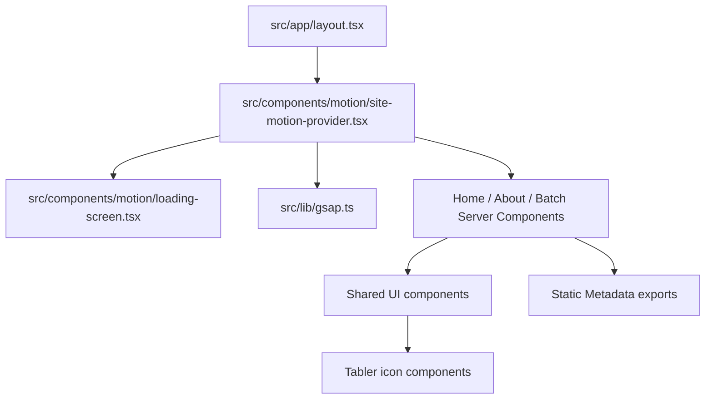

# Sekalori UI Motion, Lenis, Icons, and SEO Plan

## I. Executive Summary

- **Goal**: Upgrade the Sekalori Next.js site with Lenis smooth scrolling, GSAP-powered motion, Tabler icons, a branded loading screen, stronger interactions, readable CTAs, and page-specific SEO metadata.
- **Success Metrics**:
  - `npm run lint` and `npm run build` complete without errors after dependency and code changes.
  - `/`, `/about`, and `/batch` render with smooth scrolling, the branded initial loader, visible GSAP reveal animations, Tabler outline icons using `strokeWidth={1.5}`, and readable white "Order Now" text.
  - Browser checks confirm no incoherent overlap, no blank loader state, no broken icons/images, and page titles match the requested SEO format.

## II. Skill Matrix

| Component | Required Skill | Implementation Role |
|-----------|----------------|---------------------|
| Roadmap and dependency sequencing | `planner` | Defines implementation stages, task dependencies, and test procedures before code changes. |
| Frontend UI polish | `frontend-design` | Keeps the food/catering interface polished while adding motion and hover states without disrupting the existing Sekalori look. |
| GSAP tweens and timeline choreography | `gsap-core`, `gsap-timeline` | Drives the loading screen, entrance sequence, and micro-interactions with transform-based animations. |
| React/Next GSAP integration | `gsap-react` | Uses client components, `useGSAP`, scoped selectors, and automatic cleanup. |
| Scroll-triggered animation | `gsap-scrolltrigger` | Adds viewport reveal animations and keeps ScrollTrigger synchronized with Lenis. |
| Next.js App Router | Local Next docs in `node_modules/next/dist/docs/` | Preserves Server Component metadata exports and isolates browser-only behavior in Client Components for Next 16.2.6. |
| Official integration references | Lenis, GSAP, Tabler official docs | Confirms package names and integration patterns for `lenis/react`, `@gsap/react`, `ScrollTrigger`, and `@tabler/icons-react`. |

## III. Logic & Architecture

The pages should remain Server Components for SEO-friendly metadata. Browser-only behavior will live in client entry components mounted from `RootLayout`: one provider for Lenis and GSAP ticker synchronization, one loading screen component, and page-level motion wrappers/classes for reveal targets.

## IV. Phased Roadmap

## Stage 1: Dependencies and Integration Foundation
> **Entry Condition**: The current app builds from the existing codebase, and no implementation has started beyond this plan.
> **Exit Condition**: Required animation, scroll, and icon packages are installed and the app has client-safe integration points ready for motion work.

### Module 1.1: Package Installation

- [ ] [P1.1.1] Install motion and icon dependencies: Run `npm install lenis gsap @gsap/react @tabler/icons-react`.
      depends_on: none
      Verify: `npm ls lenis gsap @gsap/react @tabler/icons-react`

- [ ] [P1.1.2] Confirm lockfile updates: Verify `package.json` and `package-lock.json` contain the installed packages.
      depends_on: P1.1.1
      Verify: `rg '"lenis"|"gsap"|"@gsap/react"|"@tabler/icons-react"' package.json package-lock.json`

### Module 1.2: Client-Safe Motion Entrypoints

- [ ] [P1.2.1] Add GSAP registration helper: Create `src/lib/gsap.ts` to register `useGSAP` and `ScrollTrigger` once, using documented imports and avoiding server-side animation execution.
      depends_on: P1.1.1
      Verify: `rg 'registerPlugin|ScrollTrigger|useGSAP' src/lib/gsap.ts`

- [ ] [P1.2.2] Add site motion provider: Create `src/components/motion/site-motion-provider.tsx` as a Client Component that wraps children with `ReactLenis root`, imports `lenis/dist/lenis.css`, uses `autoRaf: false`, and connects Lenis `raf` to `gsap.ticker`.
      depends_on: P1.2.1
      Verify: `rg "'use client'|ReactLenis|lenis/dist/lenis.css|ticker.add|lagSmoothing" src/components/motion/site-motion-provider.tsx`

- [ ] [P1.2.3] Mount provider in root layout: Wrap `children` in `SiteMotionProvider` from `src/app/layout.tsx` without converting `layout.tsx` to a Client Component.
      depends_on: P1.2.2
      Verify: `rg 'SiteMotionProvider' src/app/layout.tsx && ! head -n 1 src/app/layout.tsx | rg "'use client'"`

### Stage 1 Test Procedures

#### Test 1.1: Dependency Resolution
- **Type**: Integration
- **Preconditions**: Stage 1 package installation is complete.
- **Steps**:
  1. Run `npm ls lenis gsap @gsap/react @tabler/icons-react`.
  2. Run `npm run lint`.
- **Expected Result**: All four packages resolve from the dependency tree, and lint exits with code `0`.
- **Pass Command**: `npm ls lenis gsap @gsap/react @tabler/icons-react && npm run lint`
- **Fail Indicators**: Missing package entries, peer dependency errors that break installation, or lint errors from unused imports.

#### Test 1.2: Next Server/Client Boundary
- **Type**: Manual
- **Preconditions**: `SiteMotionProvider` is mounted in `src/app/layout.tsx`.
- **Steps**:
  1. Inspect the first line of `src/app/layout.tsx`.
  2. Inspect `src/components/motion/site-motion-provider.tsx`.
- **Expected Result**: `layout.tsx` remains a Server Component with metadata exports intact, while the provider file starts with `'use client'`.
- **Pass Command**: `head -n 1 src/app/layout.tsx && head -n 1 src/components/motion/site-motion-provider.tsx`
- **Fail Indicators**: Root layout contains `'use client'`, metadata exports are removed, or browser APIs are executed in a Server Component.

## Stage 2: Tabler Icons and Interaction Primitives
> **Entry Condition**: Stage 1 dependencies and provider scaffolding are complete.
> **Exit Condition**: All inline UI icons are replaced with Tabler outline icons using `strokeWidth={1.5}`, and shared interactive components have consistent hover and active states.

### Module 2.1: Icon Replacement

- [ ] [P2.1.1] Replace custom icon map: Update `src/components/ui/icon-mark.tsx` to render matching Tabler icons for `leaf`, `grain`, `drop`, `cap`, `seal`, and fallback team icons with `strokeWidth={1.5}`.
      depends_on: P1.1.1
      Verify: `rg '@tabler/icons-react|strokeWidth=\\{1.5\\}' src/components/ui/icon-mark.tsx`

- [ ] [P2.1.2] Replace navigation cart SVG: Update `src/components/layout/navbar.tsx` to use a Tabler shopping/cart icon with `strokeWidth={1.5}`.
      depends_on: P2.1.1
      Verify: `rg 'IconShopping|IconBasket|strokeWidth=\\{1.5\\}' src/components/layout/navbar.tsx`

- [ ] [P2.1.3] Replace arrow and disclosure SVGs: Use Tabler icons for the home "Lihat Detail" arrow and FAQ chevron, preserving accessible labels and decorative `aria-hidden` behavior.
      depends_on: P2.1.1
      Verify: `rg '@tabler/icons-react|IconArrowRight|IconChevronDown|strokeWidth=\\{1.5\\}' src/app src/components`

- [ ] [P2.1.4] Replace decorative pseudo-icons in page pills: Convert the About service pills and Batch stat chips from CSS shape spans to Tabler icons where they represent meaning.
      depends_on: P2.1.1
      Verify: `rg 'IconCalendar|IconBowl|IconChefHat|IconCalendarWeek|strokeWidth=\\{1.5\\}' src/app`

### Module 2.2: Shared Interaction Classes

- [ ] [P2.2.1] Upgrade `ButtonLink` interactions: Add hover lift, active press, focus-visible clarity, and readable `text-white` for every primary `Order Now` path.
      depends_on: P2.1.2
      Verify: `rg 'active:|hover:|text-white|Order Now' src/components/ui/button-link.tsx src/components/layout/navbar.tsx`

- [ ] [P2.2.2] Add reusable hover affordances for cards and images: Update `MenuCard`, `BenefitCard`, `IngredientCard`, `PartnerPanel`, and hero image wrappers with transform-safe hover classes that do not resize layout.
      depends_on: P2.2.1
      Verify: `rg 'group|hover:|transition-transform|duration-' src/components src/app`

- [ ] [P2.2.3] Add link hover polish: Update nav, footer, ghost links, and FAQ summary controls with consistent hover/active animation states.
      depends_on: P2.2.1
      Verify: `rg 'hover:|active:' src/components/layout src/components/ui`

### Stage 2 Test Procedures

#### Test 2.1: Tabler Icon Coverage
- **Type**: Manual
- **Preconditions**: All Stage 2 icon tasks are complete.
- **Steps**:
  1. Run `rg '<svg|strokeWidth=\"2\"|strokeWidth=\"1.7\"|strokeWidth=\"2\"' src/app src/components`.
  2. Run `rg 'strokeWidth=\\{1.5\\}' src/app src/components`.
- **Expected Result**: No hand-authored inline SVG icon remains for UI controls or icon marks; Tabler icon usages include `strokeWidth={1.5}`.
- **Pass Command**: `rg 'strokeWidth=\\{1.5\\}' src/app src/components`
- **Fail Indicators**: Remaining custom SVG paths for icons, non-1.5 stroke widths on UI icons, or broken imports from `@tabler/icons-react`.

#### Test 2.2: CTA Readability
- **Type**: Manual
- **Preconditions**: Button and navigation interaction tasks are complete.
- **Steps**:
  1. Inspect every `Order Now` occurrence in `src/app` and `src/components`.
  2. Confirm each one renders with a green background and white text in default and hover states.
- **Expected Result**: All "Order Now" buttons use readable white text and do not inherit dark link colors.
- **Pass Command**: `rg 'Order Now|text-white' src/app src/components`
- **Fail Indicators**: Any "Order Now" text has green/dark text on a green background or loses contrast on hover.

## Stage 3: Loading Screen and GSAP Page Motion
> **Entry Condition**: Stage 2 icons and interaction primitives are complete.
> **Exit Condition**: The initial webpage load shows a readable branded loader, and visible page elements animate with GSAP while respecting reduced-motion preferences.

### Module 3.1: Branded Loading Screen

- [ ] [P3.1.1] Create loading screen component: Add `src/components/motion/loading-screen.tsx` with SEKALORI logo, primary green background, white foreground, and a progress bar.
      depends_on: P1.2.1
      Verify: `rg 'LoadingScreen|logo|progress|#1a6b3a|sekalori' src/components/motion/loading-screen.tsx`

- [ ] [P3.1.2] Animate loader with GSAP timeline: Use `useGSAP` and `gsap.timeline()` to animate logo entrance, progress fill, and loader exit; avoid layout-heavy animated properties where transforms can be used.
      depends_on: P3.1.1
      Verify: `rg 'useGSAP|gsap.timeline|scale|autoAlpha|xPercent' src/components/motion/loading-screen.tsx`

- [ ] [P3.1.3] Mount loader in motion provider: Render the loader on first client mount/reload and ensure it does not block interaction after the timeline completes.
      depends_on: P3.1.2, P1.2.3
      Verify: `rg 'LoadingScreen|onComplete|set' src/components/motion/site-motion-provider.tsx src/components/motion/loading-screen.tsx`

### Module 3.2: Scroll and Reveal Animation System

- [ ] [P3.2.1] Add page reveal wrapper: Create `src/components/motion/page-reveal.tsx` as a Client Component using `useGSAP`, scoped selectors, `ScrollTrigger.batch`, and `gsap.matchMedia()` for `prefers-reduced-motion`.
      depends_on: P1.2.1
      Verify: `rg 'useGSAP|ScrollTrigger.batch|matchMedia|prefers-reduced-motion' src/components/motion/page-reveal.tsx`

- [ ] [P3.2.2] Mark page elements for animation: Add stable classes or data attributes to hero text, hero media, sections, menu cards, benefit cards, ingredient cards, partner items, and FAQ rows.
      depends_on: P3.2.1
      Verify: `rg 'motion-reveal|motion-card|motion-image|motion-link' src/app src/components`

- [ ] [P3.2.3] Integrate reveal wrapper per layout/page: Mount the reveal system around main page content so all three routes animate after navigation without converting page metadata files to Client Components.
      depends_on: P3.2.2
      Verify: `rg 'PageReveal|motion-reveal' src/components/layout src/app`

- [ ] [P3.2.4] Refresh ScrollTrigger after image/layout readiness: Call `ScrollTrigger.refresh()` from the motion layer after loader completion and route content mount so image-driven layout changes do not desync triggers.
      depends_on: P3.1.3, P3.2.3
      Verify: `rg 'ScrollTrigger.refresh' src/components/motion src/lib`

### Stage 3 Test Procedures

#### Test 3.1: Loader Visibility and Exit
- **Type**: E2E
- **Preconditions**: Stage 3 loader tasks are complete and the dev server is running.
- **Steps**:
  1. Open `/` in a browser with a hard reload.
  2. Observe the first viewport before the page content appears.
  3. Wait for the loader timeline to complete.
- **Expected Result**: The loader shows a primary green background, a readable white SEKALORI mark/progress bar, then exits fully and leaves page controls clickable.
- **Pass Command**: `npm run build`
- **Fail Indicators**: Blank first paint, unreadable logo/progress bar, loader remains on screen, or page links cannot be clicked after exit.

#### Test 3.2: ScrollTrigger and Reduced Motion
- **Type**: Manual
- **Preconditions**: Stage 3 reveal tasks are complete.
- **Steps**:
  1. Open `/batch` and scroll through the hero, menu, and ingredients sections.
  2. Enable reduced motion in the browser or OS and reload.
  3. Scroll again through the same sections.
- **Expected Result**: Normal mode reveals sections/cards/images smoothly; reduced-motion mode avoids pronounced movement while keeping content visible.
- **Pass Command**: `npm run lint && npm run build`
- **Fail Indicators**: Scroll animations trigger out of order, content stays hidden, ScrollTrigger markers appear in production code, or reduced-motion users still receive large transform animations.

## Stage 4: SEO Metadata and Final Verification
> **Entry Condition**: Stage 3 motion behavior is implemented and visually usable.
> **Exit Condition**: SEO metadata matches the requested title format, descriptions are improved per route, and automated plus browser verification pass.

### Module 4.1: Metadata Updates

- [ ] [P4.1.1] Update root metadata defaults: Configure root metadata with a useful default description and title template support without breaking page-specific titles.
      depends_on: P1.2.3
      Verify: `rg 'title:|template|description' src/app/layout.tsx`

- [ ] [P4.1.2] Add home metadata: Export page metadata from `src/app/page.tsx` with title `Home: Isi Kalorimu dengan SEKALORI - SEKALORI Kitchen & Catering` and a stronger home description.
      depends_on: P4.1.1
      Verify: `rg 'Home: Isi Kalorimu dengan SEKALORI - SEKALORI Kitchen & Catering|description' src/app/page.tsx`

- [ ] [P4.1.3] Add About metadata: Export page metadata from `src/app/about/page.tsx` with title `SEKALORI - About` and a route-specific description.
      depends_on: P4.1.1
      Verify: `rg 'SEKALORI - About|description' src/app/about/page.tsx`

- [ ] [P4.1.4] Add Batch metadata: Export page metadata from `src/app/batch/page.tsx` with title `SEKALORI - Batch` and a route-specific description.
      depends_on: P4.1.1
      Verify: `rg 'SEKALORI - Batch|description' src/app/batch/page.tsx`

### Module 4.2: Final Validation

- [ ] [P4.2.1] Run lint: Execute the repository lint script and fix any TypeScript, JSX, or import issues introduced by motion/icon work.
      depends_on: P4.1.4, P3.2.4, P2.2.3
      Verify: `npm run lint`

- [ ] [P4.2.2] Run production build: Execute `npm run build` and fix any Next.js App Router, metadata, image, or client boundary errors.
      depends_on: P4.2.1
      Verify: `npm run build`

- [ ] [P4.2.3] Browser smoke test all routes: Start the dev server and inspect `/`, `/about`, and `/batch` on desktop and mobile widths for loader exit, animations, readable CTAs, icons, and no overlap.
      depends_on: P4.2.2
      Verify: Browser screenshots show all tested routes render correctly at desktop and mobile widths.

### Stage 4 Test Procedures

#### Test 4.1: Metadata Title Format
- **Type**: Integration
- **Preconditions**: Metadata tasks are complete.
- **Steps**:
  1. Run `npm run build`.
  2. Inspect route metadata exports in the three page files.
- **Expected Result**: Home title is exactly `Home: Isi Kalorimu dengan SEKALORI - SEKALORI Kitchen & Catering`; About and Batch titles are exactly `SEKALORI - About` and `SEKALORI - Batch`.
- **Pass Command**: `rg 'Home: Isi Kalorimu dengan SEKALORI - SEKALORI Kitchen & Catering|SEKALORI - About|SEKALORI - Batch' src/app`
- **Fail Indicators**: Missing metadata exports, titles with the old `Sekalori` value, or title template output that duplicates brand text.

#### Test 4.2: Production Build and Visual Smoke
- **Type**: E2E
- **Preconditions**: All implementation stages are complete.
- **Steps**:
  1. Run `npm run lint`.
  2. Run `npm run build`.
  3. Start `npm run dev`.
  4. Open `/`, `/about`, and `/batch` at desktop and mobile widths.
- **Expected Result**: Lint and build pass; each route shows working smooth scroll, no broken icons/images, no unreadable "Order Now" buttons, no overlapping UI, and motion does not hide content.
- **Pass Command**: `npm run lint && npm run build`
- **Fail Indicators**: Build failure, hydration error, missing Tabler icon, stuck loading screen, unreadable CTA, horizontal overflow, or content hidden after scroll.

## V. Final Verification Checklist

- [ ] `npm ls lenis gsap @gsap/react @tabler/icons-react` confirms required packages.
- [ ] `npm run lint` exits with code `0`.
- [ ] `npm run build` exits with code `0`.
- [ ] `/`, `/about`, and `/batch` show the branded green loading screen on first load and then become interactive.
- [ ] Lenis smooth scrolling works and ScrollTrigger animations stay synchronized after scrolling and resizing.
- [ ] Every UI icon comes from `@tabler/icons-react` and uses `strokeWidth={1.5}`.
- [ ] Buttons, cards, images, and links have visible hover/active states without layout shift.
- [ ] All "Order Now" buttons use white text in default and hover states.
- [ ] Page titles match the requested SEO format and descriptions are route-specific.
- [ ] Desktop and mobile browser checks show no incoherent overlap, hidden content, or broken image/icon rendering.
